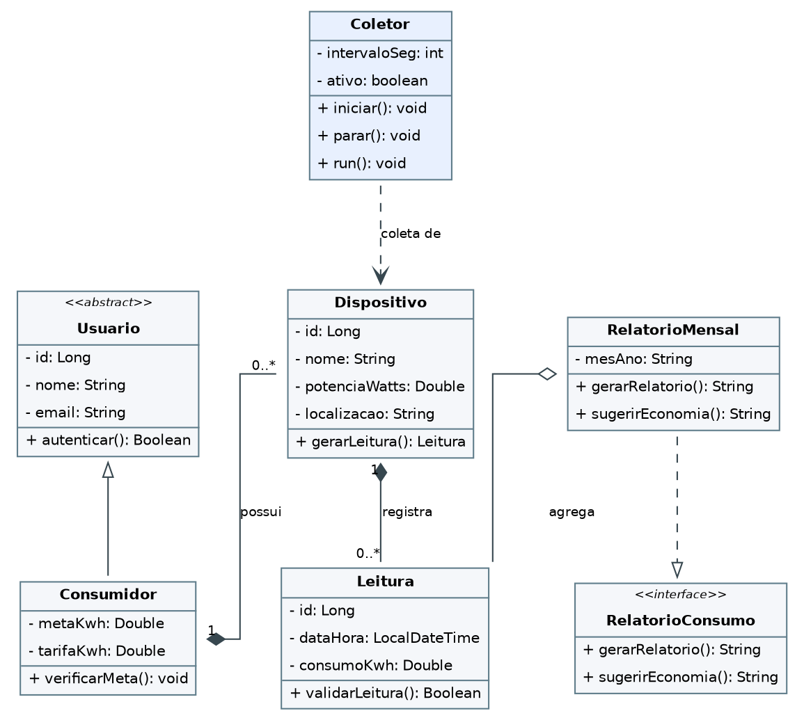
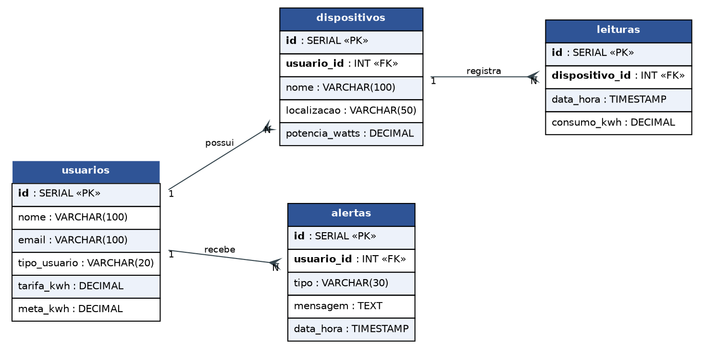

# Documentação — EcoPower Monitor

Esta pasta reúne os diagramas do projeto exigidos na 1ª entrega da AEP.

## Diagrama de Classes (UML)

Pontos que o diagrama demonstra:

- **Herança:** a classe abstrata `Usuario` é a base de `Consumidor`, que reaproveita seus atributos e comportamentos.
- **Composição / multiplicidade 1:N:** um `Consumidor` possui vários `Dispositivos` (1:N) e cada `Dispositivo` possui várias `Leituras` (1:N).
- **Polimorfismo:** a interface `RelatorioConsumo` define os métodos `gerarRelatorio()` e `sugerirEconomia()`, implementados por `RelatorioMensal`.
- **Concorrência:** a classe `Coletor` coordena as threads que geram as leituras periódicas dos dispositivos (parte de Sistemas Operacionais).

## Diagrama de Banco de Dados (DER)

Tabelas:

- **usuarios** — cadastro do morador, tarifa e meta de consumo.
- **dispositivos** — aparelhos vinculados ao usuário (1:N com `usuarios`).
- **leituras** — medições de consumo de cada aparelho (1:N com `dispositivos`).
- **alertas** — avisos gerados quando a meta é aproximada ou ultrapassada.

O script de criação dessas tabelas está em [`../database/schema.sql`](../database/schema.sql).
